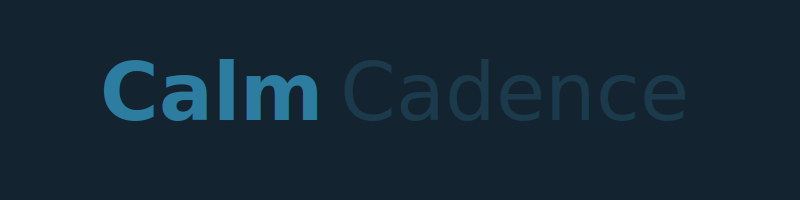

<p align="center">
  
</p>

<p align="center">
  <a href="https://github.com/Snapwave333/CalmCadence/actions/workflows/main.yml">
    
  </a>
  
  
  
</p>

# CalmCadence

A Windows (WinUI 3) productivity app that unifies tasks, calendar events, routines, and habits into a daily brief you can read and listen to. CalmCadence uses a local SQLite database, Entity Framework Core, and optional integrations (ICS import/export, Google Calendar, Gemini). It can generate audio and video summaries of your day, schedule background runs, and deliver quiet-hours-aware notifications.

## Table of Contents
- Overview
- Features
- Screenshots & Media
- Quick Start
- Configuration
- Architecture
- Video & Audio Pipeline
- Google Integration
- Cutting a Release
- Contributing
- Roadmap

## Overview
This repository is organized as a multi-project .NET solution:
- CalmCadence.App — WinUI 3 desktop application (UI layer)
- CalmCadence.Core — Domain models, interfaces, and services (Gemini, QuickAdd, etc.)
- CalmCadence.Data — EF Core DbContext, model configurations, ICS service, data services
- CalmCadence.Tests — Unit tests for core logic and data

## Features
- Daily Brief generation: summary, agenda, top tasks, habit status
- Multi-tier audio brief generation: NotebookLM (primary) with Gemini TTS fallback; offline fallback when APIs are unavailable
- Agenda generation from Tasks, Events, Routines, Habits
- ICS import/export (SimpleIcsService)
- Notification scheduling respecting Quiet Hours and Low Sensory mode
- Local SQLite storage in %LocalAppData%/CalmCadence/calmcadence.db
- Optional slideshow video generation (FFmpeg) with audio mux

## Screenshots & Media
- Branding: see CalmCadence_Branding_Pack for icons and hero artwork.
- Daily Studio playback uses MediaPlayerElement to play the generated video (preferred) or audio-only brief.

## Quick Start
Prerequisites:
- Windows 10 (build 19041) or later
- .NET SDK 9.0
- Visual Studio 2022 (17.10+) with .NET Desktop workload
- Windows App SDK and WebView2 runtime
- PowerShell 7+
- Optional: FFmpeg on PATH (for video generation), Google OAuth credentials

Build & Test:
```powershell
# From repository root

# Restore & build entire solution
dotnet restore
dotnet build CalmCadence.sln -c Release

# Run tests
dotnet test CalmCadence.Tests/CalmCadence.Tests.csproj -c Release
```

Run (IDE):
- Open CalmCadence.sln in Visual Studio and press F5.

## Configuration
- Database path: %LocalAppData%/CalmCadence/calmcadence.db
- Settings are stored in the database (Quiet Hours, Low Sensory mode, Daily Studio options)
- Gemini and Google APIs are optional; configure via your own credentials and secure storage

### EF Core
CalmCadence.Data uses EF Core (SQLite). If you need migrations, ensure the dotnet-ef tool is installed:
```powershell
# Install EF Core tooling
dotnet tool install --global dotnet-ef

# Create migration (example)
dotnet ef migrations add InitialCreate --project CalmCadence.Data

# Update database
dotnet ef database update --project CalmCadence.Data
```

## Architecture
- CalmCadence.App
  - App startup and DI
  - Views (DailyStudioPage, MainPage, GoogleIntegrationPage, Routine pages)
  - Services (DailyStudioService, AgendaGenerator, NotificationService)
- CalmCadence.Core
  - Interfaces (IDailyStudioService, IAgendaGenerator, INotificationService, IGeminiService, ICalendarService, etc.)
  - Models (TaskItem, EventItem, Habit, HabitLog, DailyMedia, Settings, BriefInput/Output)
  - Services (GeminiService, QuickAddParser, GoogleApiService)
- CalmCadence.Data
  - EF Core DbContext and configurations
  - Services (DailyStudioService for data-backed brief, SimpleIcsService)
- CalmCadence.Tests
  - Unit tests for core/data services

## Video & Audio Pipeline
- Slideshow video (1920×1080) from the brief (Summary, Agenda, Top Tasks, Habits, Notes)
- Slides rendered with System.Drawing, assembled with FFmpeg into MP4 (H.264, yuv420p, ~6s/slide @ 30fps)
- If an audio brief exists for the date, it is muxed into the video (AAC)
- Output path: `%LocalAppData%/CalmCadence/DailyMedia/daily-brief-YYYY-MM-DD.mp4`
- Slides staged under: `%LocalAppData%/CalmCadence/DailyMedia/YYYY-MM-DD/slides/`
- Requirement: FFmpeg on PATH (`ffmpeg`). If FFmpeg is not found or fails, the app gracefully skips video creation and keeps the audio-only brief.

## Google Integration (OAuth + Sync)
CalmCadence supports Google Calendar OAuth sign-in and bi-directional sync.
A dedicated UI page is available: Main Page → Google Integration.

Setup:
- Create OAuth 2.0 Client credentials (Desktop app) in Google Cloud Console.
- Set environment variables for the app to locate client secrets:
  - `CALMCADENCE_GOOGLE_CLIENT_ID`
  - `CALMCADENCE_GOOGLE_CLIENT_SECRET`
- Optional: Instead of env vars, place a JSON file at:
  - `%LocalAppData%/CalmCadence/google_client_secrets.json`
  - Use the standard "installed" client format with client_id and client_secret.

Using the Google Integration page:
- Sign in with Google: launches browser-based OAuth and stores an encrypted refresh token.
- Sign out: removes the stored token.
- Sync Now: executes a sync for the last 7 days and the next 7 days.
- Status text indicates whether a user is signed in.

Notes:
- Tokens are encrypted per-user using Windows DPAPI and stored under:
  - `%LocalAppData%/CalmCadence/google_oauth_tokens.json.enc`
- The provider uses your primary calendar by default.
- Headless sync is supported via command-line: `CalmCadence.App.exe --run-google-sync`

## Cutting a Release
CalmCadence uses Git tags to produce versioned, signed MSIX bundles and a GitHub Release automatically.

Prerequisites:
- GitHub Secrets in the repository settings:
  - `BASE64_ENCODED_PFX` (required to sign) — your code-signing certificate as base64-encoded `.pfx`
  - `PFX_PASSWORD` (optional) — password for the `.pfx`, if applicable
- Optional: ensure FFmpeg is available on development machines for local video generation (not required for CI).

Tag formats:
- Stable release: `vMAJOR.MINOR.PATCH` (e.g., `v1.0.0`)
- Pre-release: `vMAJOR.MINOR.PATCH-rc.N` or `vMAJOR.MINOR.PATCH-beta.N` (e.g., `v1.0.0-rc.1`)

Steps to cut a release:
```powershell
# From repository root

# Create and push a stable tag
git tag v1.0.0
git push origin v1.0.0

# Or create and push a pre-release tag
git tag v1.0.0-rc.1
git push origin v1.0.0-rc.1
```

What the pipeline does on tag builds:
- Stamps assemblies with `Version = X.Y.Z` and `AssemblyInformationalVersion = X.Y.Z+<commit SHA>`
- Produces MSIX packages with 4-part version: `X.Y.Z.<run_number>` (required by MSIX)
- Signs MSIX artifacts if `BASE64_ENCODED_PFX` is present (uses `PFX_PASSWORD` if provided)
- Computes SHA256 checksums for each package
- Publishes a GitHub Release attached to the tag, including:
  - `CalmCadence-x64-MSIX` and `CalmCadence-ARM64-MSIX` artifacts
  - `.sha256` checksum files for integrity verification
- Marks the release as a pre-release if the tag contains a hyphen (e.g., `-rc.1`)

Verification:
- Download artifacts from the GitHub Release page and install `.msix`
- In Windows Settings → Apps → CalmCadence, confirm the version shows `X.Y.Z.<run_number>`
- Launch the app and verify Daily Studio playback and OAuth flows in the packaged environment

Notes:
- Local/dev builds use defaults defined in `Directory.Build.props` (e.g., `0.1.0-dev`) unless overridden
- If no signing certificate is provided, MSIX artifacts are unsigned but still published
- Ensure the Windows SDK is available on the CI runner for SignTool; this is provided by `windows-latest`

## Contributing
- Submit PRs with tests where appropriate.
- Follow .NET coding guidelines and keep domain logic in Core, data access in Data, and UI in App.
- Keep changes small and focused; prefer minimal diffs and add validation steps.

## Roadmap (Planned / In Progress)
- Video generation: FFmpeg slideshow pipeline
- Live on-screen notifications: Windows App SDK AppNotification (toasts)
- Background scheduling: automatic daily brief generation at a configured time
- Calendar sync: additional providers beyond ICS, e.g., Google Calendar
- Audio pipeline: Multi-tier approach (NotebookLM primary, Gemini TTS fallback; offline fallback)

## CI
GitHub Actions workflow is defined at `.github/workflows/main.yml` and runs build + tests.

---

Run & Verify
```powershell
# Build & test
dotnet restore
dotnet build CalmCadence.sln -c Release
dotnet test CalmCadence.Tests/CalmCadence.Tests.csproj -c Release

# Launch the WinUI app via IDE (Visual Studio) and open the Daily Studio page.
```

